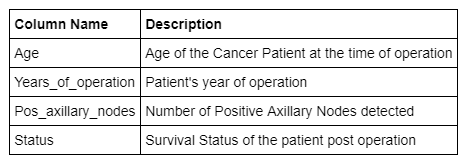
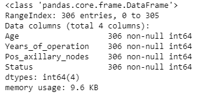
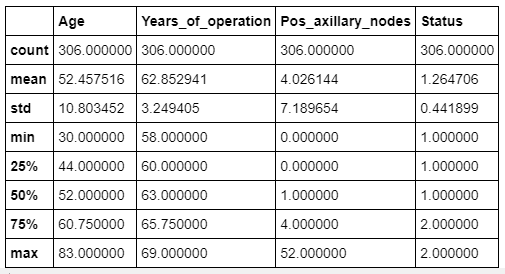
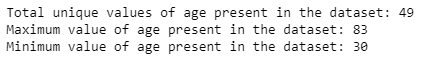
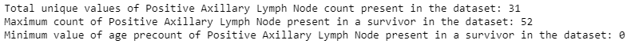
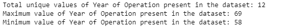
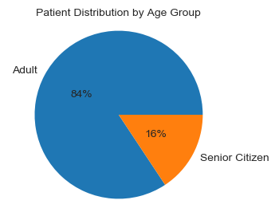
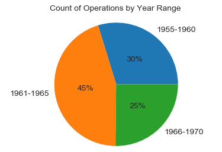
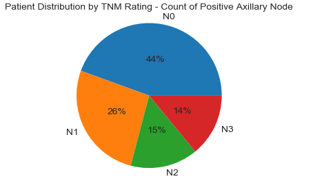
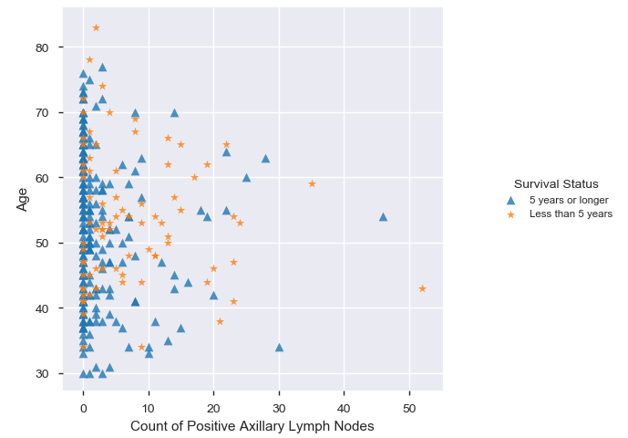

# Exploratory Data Analysis - Breast Cancer Survival Dataset

In this excercise, we will perform Exploratory Data Analysis to predict whether a patient undergoing surgery for breast cancer survives for more than 5 years or not, based on the age, year of operation and the number of positive axillary nodes detected.

The dataset contains cases from a study that was conducted between 1958 and 1970 at the University of Chicago's Billings Hospital on the survival of patients who had undergone surgery for breast cancer. The dataset consists of the information about cancer patient and their survival status after operation based on their age at the time of operation & count of positive axillary node found in the patient. The dataset comprises of 306 observations of 4 columns.

The most important inference drawn from all this analysis is, we get to know what are the features on which survival is highly positively and negatively coorelated with e.g. relationship between Survival Status with the Count of Positive Axillary Nodes detected in the patient and the Age of the patient at the time of operation. The observations also shows the co-relation between the Count of Positive Axillary Nodes detected in the patient and the Age of the patient at the time of operation to their length of __Survival post operation__.

[Jupyter Notebook](./EDA_Breast_Cancer_Survival_Notebook.ipynb)
