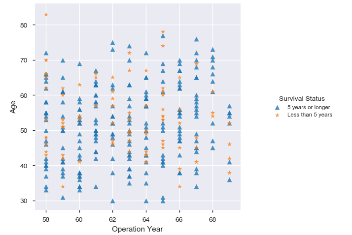
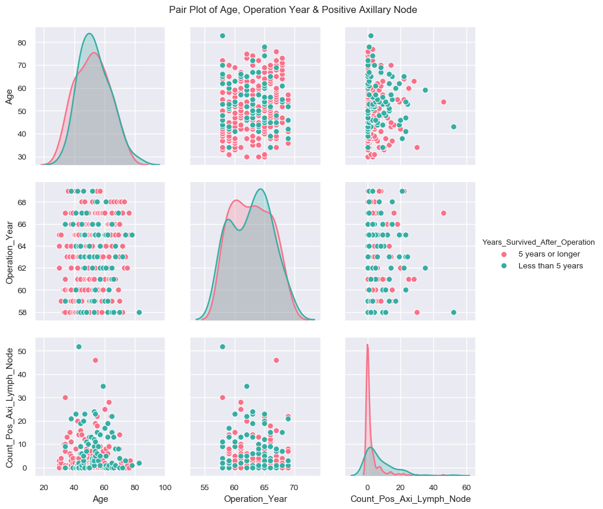

# Exploratory Data Analysis - Breast Cancer Survival Dataset

In this excercise, we will perform Exploratory Data Analysis to predict whether a patient undergoing surgery for breast cancer survives for more than 5 years or not, based on the age, year of operation and the number of positive axillary nodes detected.

The dataset contains cases from a study that was conducted between 1958 and 1970 at the University of Chicago's Billings Hospital on the survival of patients who had undergone surgery for breast cancer. The dataset consists of the information about cancer patient and their survival status after operation based on their age at the time of operation & count of positive axillary node found in the patient. The dataset comprises of 306 observations of 4 columns, as given below.

Below is the dataset information,

Below is the statistical measues of the dataset information,

- Age of patient at the time of operation has a mean of 52 yeras, with a min of 30 & max of 83 years.
- The operations took place in the range of years 1958 - 1969, with the women undergoing operation at the minimum age of 30 was in 1958 and the women undergoing operation at a maximum age of 83 was in 1969.
- The minimum number of positive axillary nodes detected in any patient of the given sample was 0 and maximum number was 52.
- The mean of the "Status" column is closer to 1, as a result it can be infferred, that more patients in the given sample survived 5 years or more after operation.

Key information as can be found in the dataset as as follows,

We used the __TNM Classification of Malignant Tumors (TNM)__ to create a categorical variable for the count of __Axillary Nodes__ detected in a patient. __TNM__ is a globally recognised standard for classifying the extent of spread of cancer. It is a classification system of the anatomical extent of tumor cancers. It has gained wide international acceptance for many solid tumor cancers, but is not applicable to leukaemia and tumors of the central nervous system. Most common tumors have their own TNM classification.

__T__ describes the size of the original (primary) tumor and whether it has invaded nearby tissue, __N__ describes nearby (regional) lymph nodes that are involved, __M__ describes distant metastasis (spread of cancer from one part of the body to another).

__N0__ - Axillary and other nearby lymph nodes do not have cancer or only have isolated tumor cells (individual cancer cells), when looked at under a microscope.

__N1__ - Micrometastases (very small clusters of cancer) OR 1–3 axillary lymph nodes have cancer AND/OR Internal mammary nodes have cancer or micrometastases (very small clusters of cancer cells) found on sentinel node biopsy

__N2__ - 4–9 axillary lymph nodes have cancer OR Internal mammary nodes have cancer, but axillary lymph nodes do not have cancer.

__N3__ - 10 or more axillary lymph nodes have cancer OR Infraclavicular (under the clavicle) nodes have cancer OR Internal mammary nodes have cancer plus 1 or more axillary lymph nodes have cancer OR 4 or more axillary lymph nodes have cancer plus internal mammary nodes have cancer or micrometastases found on sentinel node biopsy OR Supraclavicular (above the clavicle) nodes have cancer.

The sample population consists of only Adults (25 - 64 years) & Senior Citizens (65 years or more). Adults count is 84% (258), while the Seniors are 16% (48).

The maximum count of operation in a given 5 year range was between the year 1961 & 1965. This is 45% of the total operations conducted.
30% of the operations hsppened between 1955 - 1960 and 25% between 1966-1970.

A total of 136 patients were in N0 rating (less than 1 Positive node detected) in the given sample. This is 44% of the sample population.
A total of 81 patients were in N1 rating (less than 3 Positive node detected) in the given sample. This is 26% of the sample population.
A total of 46 patients were in N2 rating (less than 10 Positive node detected) in the given sample. This is 15% of the sample population.
A total of 43 patients were in N4 rating (more than 9 Positive node detected) in the given sample. This is 14% of the sample population.

Most of the patients had 0 Positive Axillary Node detected and they survived 5 years or longer after the operation.
Higher percentage of the patients with 4 or more Positive Axillary Node detected, survived less than 5 years after operation.
Only patient with more than 50 Positive Axillary Node detected, died within 5 years of the operation.
Most of the patients in the age range 30 - 65 years i.e Adults had less than 10 Positive Axillary Node detected.

Most of the patients were in the Age range 40 - 70 years at the time of operation.
Higher percentage of the patients in the Age range 30 - 40 years at the time of operation, survived 5 years or longer.
Only patient above 80 years of age at the time of operation, died within 5 years of the operation.
Most of the patients are in the age range 30 - 65 years i.e Adults.

#### Observations

The most important inference drawn from this analysis is, we get to know what are the features on which __Survival__ is highly positively and negatively coorelated with e.g. relationship between Survival Status with the Count of Positive Axillary Nodes detected in the patient and the Age of the patient at the time of operation. The observations also shows the co-relation between the Count of Positive Axillary Nodes detected in the patient and the Age of the patient at the time of operation to their length of __Survival post operation__.

[Jupyter Notebook](./EDA_Breast_Cancer_Survival_Notebook.ipynb)
