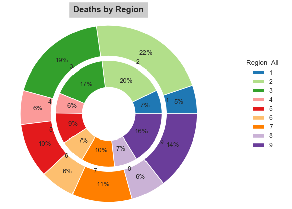

# Exploratory Data Analysis - Mortality Data of US Cities between 1962 - 2016

In this excercise, our goal is to perform an EDA on the complete set of data reported across US Cities Mortality Reporting System. The system was retired as of 10/6/2016. The data contains, the vital statistics offices of cities across the United States reported the total number of death certificates processed and the number of those for which pneumonia or influenza was listed as the underlying or contributing cause of death by age group. In this excercise, our goal is to perform an EDA on the complete set of data reported to 122 Cities Mortality Reporting System. The system was retired as of 10/6/2016. The data contains, the vital statistics offices of the  cities across the United States reported the total number of death certificates processed and the number of those for which pneumonia or influenza was listed as the underlying or contributing cause of death by age group.

The dataset provides the mortality data for the below __Regions of USA__ between the years __1962 - 2016__,

The dataset has the following __Attributes__,

Below table provides the __dataset information__,

The dataset has the following counts for unique __States & Cities__,

Below is the distribution of mortality based on __Regions__,

Below is the distribution of mortality based on __Years__,

Below is the distribution of mortality based on __Age Groups__,

The death in the age group of 65 years or more, follows the relative pattern as the all death counts.
The death tolls in the age group of 0 to 64 is relatively lower compared to the age group 65 years & more.

Below is the distribution of mortality based on __States__,

Below is the distribution of mortality in the __State of New York__,

Below is the distribution of mortality based on __Cities__,

- The most important inference drawn from all this analysis is, we get to know what are the Flu has been a major cause of deaths across US except in the state of New York. In the state of New York there were other causes, which largely contributed to All Deaths.
- The observations from the excercise clearly shows the co-relation between the All Deaths & Flu Deaths and the various Age Groups.
- There is a clear pattern in the number of Flu related deaths across years. The number of Flu related deaths have been increasing gradually since 1985.
- From the pie chart, it is clear that, the count of Flu related deaths are proportional to the count of all deaths in a given Regions.
New York, California, Texas, Ohio, Pennsylvania and Illinoi has the highest count of all deaths.
- Similarly, Idaho, Kentucky, Rhode Island, Iowa, Hawaii etc have the lowest count of all deaths.
- The maximum cumulitive deaths have occurred in the cities of New York, Chicago, Los Angeles, Philadelphia, Houston, Detroit & Baltimore.

#### Observations

The observations from the above excercise, clearly shows that the Flu related deaths across US is proportionate to All deaths in various regions & states except the State of New York, where it contributes a negligible count towards the death toll. The city of Ultica has the lowest count of all deaths. The city of Schenectady has the lowest flu related deaths. However, Flu deaths makes a smaller subset of the total deaths across USA.

[Jupyter Notebook](./EDA_Mortality_US.ipynb)
