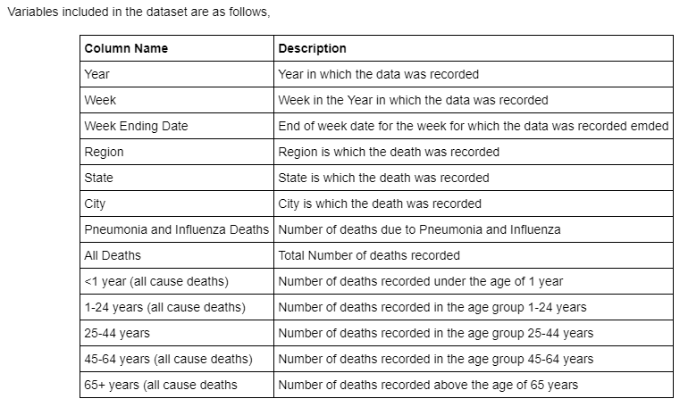
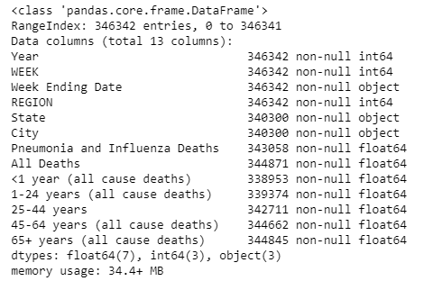
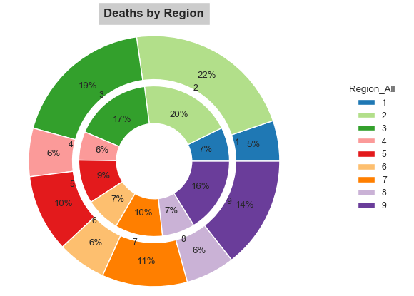
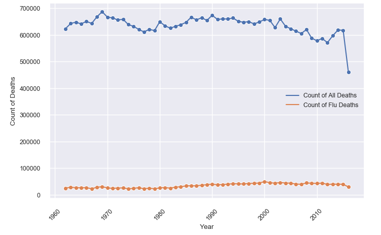
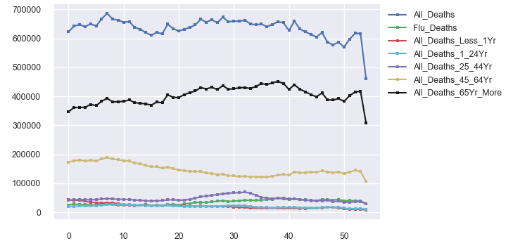
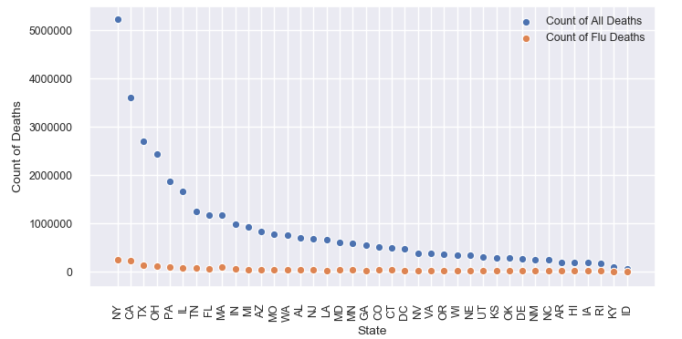
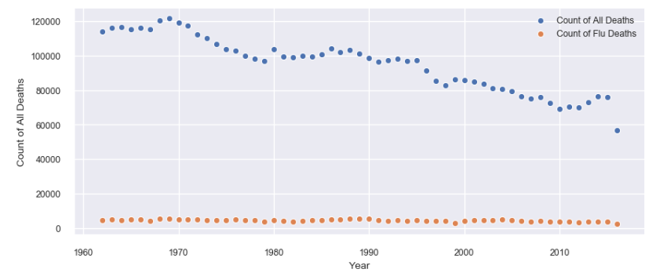
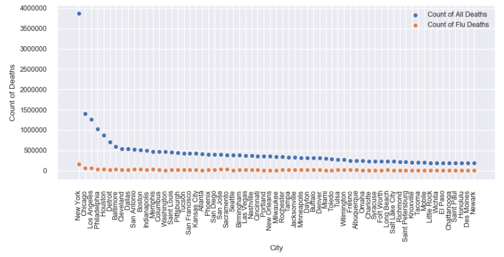

# Exploratory Data Analysis - Mortality Data of US Cities between 1962 - 2016

In this excercise, our goal is to perform an EDA on the complete set of data reported to 122 Cities Mortality Reporting System. The system was retired as of 10/6/2016. The data contains, the vital statistics offices of 122 cities across the United States reported the total number of death certificates processed and the number of those for which pneumonia or influenza was listed as the underlying or contributing cause of death by age group. In this excercise, our goal is to perform an EDA on the complete set of data reported to 122 Cities Mortality Reporting System. The system was retired as of 10/6/2016. The data contains, the vital statistics offices of 122 cities across the United States reported the total number of death certificates processed and the number of those for which pneumonia or influenza was listed as the underlying or contributing cause of death by age group.

[Jupyter Notebook](./EDA_Mortality_US.ipynb)
